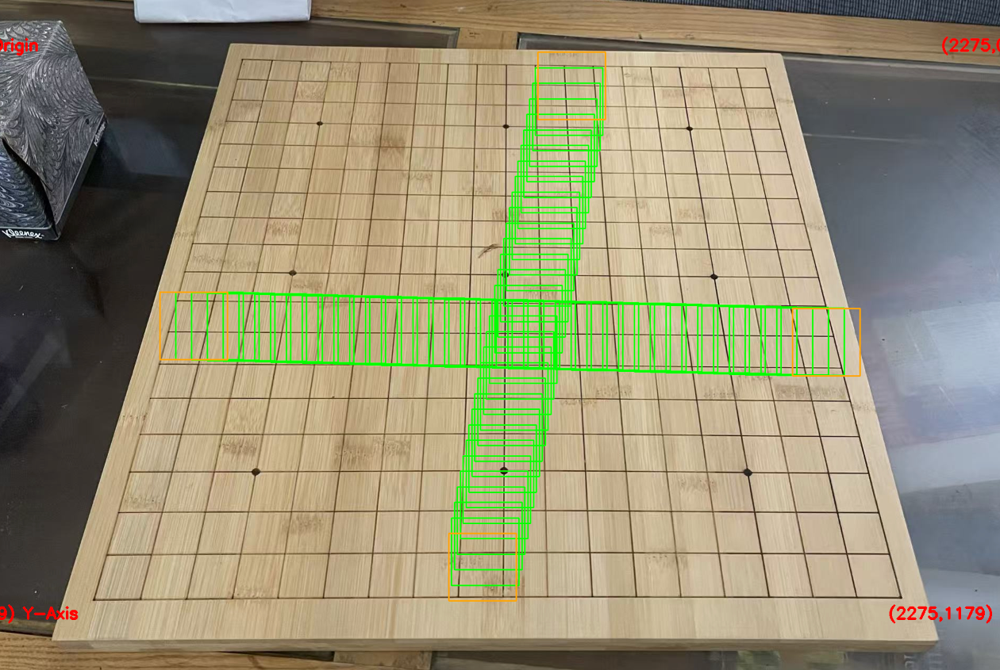
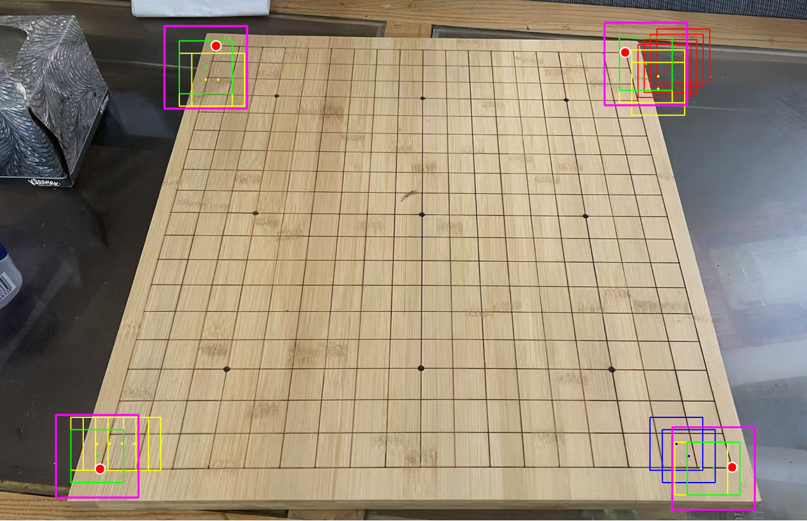
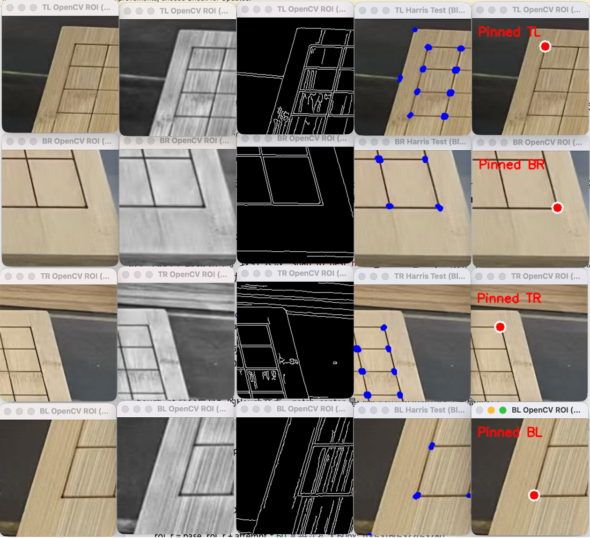
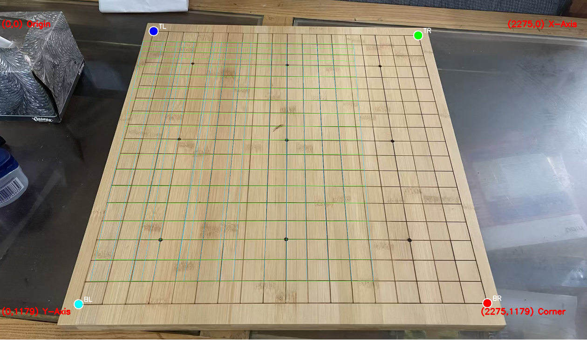
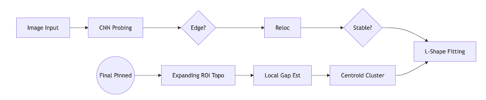

# Weiqi Board Corner Detection (Hybrid AI-CV) Technical Analysis & Debugging Summary
### Author: Tu,Xinyu  3/22/2026

This document provides a comprehensive technical overview of the **WeiqiBoardDetect** project, focusing on precise corner detection and topological validation. By combining Deep Learning (CNN) with traditional Computer Vision (OpenCV + Harris), we have successfully addressed the challenges posed by extreme perspective distortion and complex backgrounds.

---

## Core Algorithmic Breakthroughs (Algorithm Innovations)

### 1. CNN-Driven Edge Probing
**Context**: Traditional edge detection is often misled by wood grain or complex backgrounds.
**Innovation**: We developed an **active probing algorithm** starting from the board's center. Using a trained 4-class CNN model (Corner, Inner, Edge, Outer), the system probes outward in four quadrants to locate the boundary between the board and the background.

**Technical Details**: Probing occurs along the primary grid orientation. When the CNN predicts `Outer`, a **Binary Search** is triggered to pin the exact `Edge` intersection.

<div align="center">
  
  <br>
  <i>Figure 1: CNN-driven edge probing trajectory with binary search refinement</i>
</div>

**Core Implementation:**
```python
# Probing along the main direction until a non-Inner label is hit
for step in range(max_steps):
    label, conf = self.classify_patch(img, (xi, yi))
    if label == 'Outer' and last_inner_pt:
        # Boundary crossover detected; initiate binary search for precision
        edge_pt = self._binary_search(img, last_inner_pt, (xi, yi))
        return edge_pt, 'Edge'
```

### 2. CNN Corner Relocation & Anti-Oscillation Mechanism
**Problem**: Initial edge intersections are often inaccurate due to distortion, causing the AI to oscillate along a single axis without finding the corner.
**Innovation**: We implemented **Multi-directional Probing**. When the CNN identifies an `Edge`, the system probes both horizontally and vertically.
- If both directions are blocked by `Outer`, the system recognizes it has overshot the corner and triggers a **Backtrack** towards the image center.
**Result**: This ensures the CNN consistently settles on a high-confidence `Corner` patch, eliminating localization drift.

<div align="center">
  
  <br>
  <i>Figure 2: CNN-guided trajectory for corner patch localization</i>
</div>

**Core Implementation:**
```python
# Probe horizontal and vertical steps to analyze corner orientation
if label == 'Edge':
    lx_label, _ = self.classify_patch(img, (int(cx + v_x[0]), int(cy)))
    ly_label, _ = self.classify_patch(img, (int(cx), int(cy + v_y[1])))
    if not can_move_x and not can_move_y:
        # Priority: If blocked, backtrack inward towards center along Y or X axis alternatively
        if backtrack_count % 2 == 1:
            cy -= v_y[1]
        else:
            cx -= v_x[0]
```

### 3. Hybrid Localization: CNN + OpenCV Engine
**Innovation**: Once the CNN secures the Corner Patch, the **OpenCV Engine** takes over for sub-pixel precision.
- Uses **HoughLinesP** within the ROI to detect local grid boundaries.
- Applies global orientation constraints to filter out wood grain noise.

**Core Implementation:**
```python
# Filter local lines matching the global grid orientation
lines = cv2.HoughLinesP(edges, 1, np.pi/180, 25, minLineLength=20)
for seg in lines:
    rt = segment_to_rho_theta(...)
    if abs(circular_angle_diff(rt[1], global_angle)) < np.radians(30):
        candidates.append(rt)
# Locate the L-shape "second outermost" line (ignoring the wooden frame)
best_h = sorted(h_lines, key=lambda x: x[1], reverse=take_max)[1]
```

### 4. Harris Centroid Clustering
**Problem**: Raw Harris responses result in hundreds of individual pixels, making topological validation computationally expensive.
**Innovation**: We use `connectedComponentsWithStats` to aggregate pixel clusters into discrete **Centroids**.
**Result**: This reduces noise into 7–16 clean candidate points, faithfully restoring the board's geometric topology.

**Core Implementation:**
```python
# Aggregate Harris response clusters into discrete centroids
ret, thresh_img = cv2.threshold(dst, thresh, 255, cv2.THRESH_BINARY)
num_labels, labels, stats, centroids = cv2.connectedComponentsWithStats(thresh_img)
all_harris_global = [(int(c[0]) + x1, int(c[1]) + y1) for c in centroids[1:]]
```

### 5. Local Gap Estimation & Perspective Compensation
**Problem**: Global average grid spacing (e.g., 25px) fails in regions with extreme perspective stretching (e.g., the BR corner having an actual gap of 82px).
**Innovation**: The `_estimate_local_gap_from_harris` function dynamically calculates the median distance between local Harris points to derive a region-specific **Local Gap**.
**Result**: Resolves geometric validation failures in distorted board areas.

**Core Implementation:**
```python
# Analyze Harris neighbor distances to estimate the true local gap
dists = sorted([np.linalg.norm(p1 - p2) for p1, p2 in pairs])
n_short = max(1, len(dists) // 2)
local_gap = float(np.median(dists[:n_short]))
```

### 6. Expanding ROI Adaptive Search & Strict Veto
**Innovation**:
- **Expanding ROI**: If topological validation fails, the search ROI expands in steps of 60px (100 -> 160 -> 220 -> 280px).
- **Strict Veto Logic**: Any Harris point detected in a `forbidden_dir` (outside the board) results in an immediate disqualification of the candidate.

**Core Implementation:**
```python
# Retry loop: Progressively expand search radius for missing neighbors
for attempt in range(MAX_EXPAND + 1):
    roi_r = base_roi_r + attempt * 60
    candidates = [p for p in all_harris_global if dist(p, hough_pt) < roi_r]
    # Strict topological validation
    if neighbor_in_forbidden_dir: return False # Immediate Veto
```

<div align="center">
  
  <br>
  <i>Figure 3: Step-by-step demonstration of Hybrid OpenCV + Harris refinement</i>
</div>

### Successful Quad-Corner Pinned
<div align="center">
  
  <br>
  <i>Figure 4: Final sub-pixel precise localization for all four corners</i>
</div>

---

## The Debug Journey

Key milestones during the development of `hybrid_scanner_v4_2.py`:

1. **Restoring Visualization**:
   - Recovered the **Trajectory Canvas** after major refactoring (V4.1) to regain visibility into the AI's decision-making flow.

2. **Corner Topo Optimization**:
   - Identified that TR detection failures were due to candidates being just outside the initial 100px ROI. Resolved by implementing the **Expanding ROI** retry logic.

3. **Code Stability**:
   - Fixed critical `NameError` and `IndentationError` (caused by nested comment blocks) to ensure robust execution.

---

## Status Summary (as of March 22, 2026)

**Status**: [SUCCESS] - TL, TR, BR, BL ALL PINNED.  
**Date**: March 22, 2026  
**Key Takeaways**:  
1. Built a board detection engine resilient to extreme perspective and complex wood grain textures.  
2. Identified further optimization opportunities for the probing speed (planned for next version).  
3. Working toward solving edge cases for other board-environment combinations.

## Detect Process (Roadmap)
<div align="center">
  
  <br>
  <i>Figure 5: Corner Detection Process</i>
</div>
