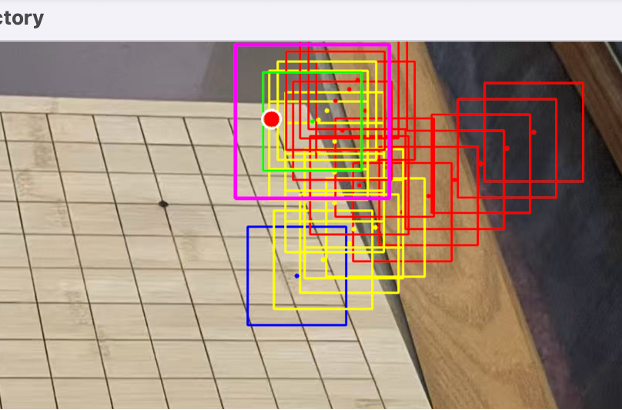

# Weiqi Board Corner Detection (Hybrid AI-CV) Technical Analysis & Debugging Summary

This document provides a comprehensive technical overview of the **WeiqiBoardDetect** project, focusing on precise corner detection and topological validation. By combining Deep Learning (CNN) with traditional Computer Vision (OpenCV + Harris), we have successfully addressed the challenges posed by extreme perspective distortion and complex backgrounds.

---

## Core Algorithmic Breakthroughs (Algorithm Innovations)

### 1. CNN-Driven Edge Probing
**Context**: Traditional edge detection is often misled by wood grain or complex backgrounds.
**Innovation**: We developed an **active probing algorithm** starting from the board's center. Using a trained 4-class CNN model (Corner, Inner, Edge, Outer), the system probes outward in four quadrants to locate the boundary between the board and the background.

**Technical Details**: Probing occurs along the primary grid orientation. When the CNN predicts `Outer`, a **Binary Search** is triggered to pin the exact `Edge` intersection.

<div align="center">
  
  <br>
  <i>Figure 1: CNN-driven edge probing trajectory with binary search refinement</i>
</div>

**Core Implementation:**
```python
# Probing along the main direction until a non-Inner label is hit
for step in range(max_steps):
    label, conf = self.classify_patch(img, (xi, yi))
    if label == 'Outer' and last_inner_pt:
        # Boundary crossover detected; initiate binary search for precision
        edge_pt = self._binary_search(img, last_inner_pt, (xi, yi))
        return edge_pt, 'Edge'
```

### 2. Two-Phase CNN Corner Search (Anti-Oscillation)
**Problem**: Initial edge intersections are often inaccurate due to distortion. Early versions would begin single-axis probing as soon as the first `Edge` was encountered, resulting in shallow patches with insufficient board content. This caused oscillation loops where the algorithm repeatedly retreated and returned to the same blocked position.

**Innovation**: We implemented a **Two-Phase Search** strategy:

- **Phase 1 (Deep Retreat)**: Starting from the OpenCV approximate corner (usually `Outer`), the system retreats continuously toward the image center. Critically, `Edge` patches are treated identically to `Outer` — the retreat does not stop until `Inner` is reached. The last `Edge` position before `Inner` becomes the deep anchor.
- **Phase 2 (Edge Sliding)**: From the deep anchor, the system probes X and Y directions to navigate along the board edge toward the `Corner`.
  - **Axis Locking**: After a deep retreat along one axis, that axis is locked. The search then slides only along the other axis, preventing diagonal drift back to the blocked position.
  - **Force-Forward on Double-Outer**: When both X and Y probes return `Outer`, the system does **not** block. Instead, it forces a full-step forward, allowing the main loop's `Outer` handler to redirect toward center. This prevents false deadlocks near the actual corner.

**Result**: This ensures the CNN consistently navigates to the corner from a sufficiently deep starting point, eliminating oscillation and shallow-patch failures.

<div align="center">
  
  <br>
  <i>Figure 2: CNN-guided two-phase trajectory for corner patch localization</i>
</div>

**Core Implementation:**
```python
# ===== Phase 1: Retreat through Outer AND Edge until Inner is reached =====
for k in range(30):
    label, conf = self.classify_patch(img, (int(cx), int(cy)))
    if label == 'Edge':
        last_edge_pos = (cx, cy)  # Record, keep retreating
    if label == 'Inner':
        cx, cy = last_edge_pos   # Anchor at deepest Edge
        break
    # Both Outer and Edge: continue retreating toward center
    dx, dy = center_x - cx, center_y - cy
    dist = (dx**2 + dy**2)**0.5
    cx += (dx / dist) * step;  cy += (dy / dist) * step

# ===== Phase 2: Slide along edge to find Corner =====
if label == 'Edge':
    lx_label, _ = self.classify_patch(img, (int(cx + v_x[0]), int(cy)))
    ly_label, _ = self.classify_patch(img, (int(cx), int(cy + v_y[1])))
    can_move_x = lx_label in ['Inner', 'Edge']
    can_move_y = ly_label in ['Inner', 'Edge']
    if locked_axis == 'X': can_move_x = False
    elif locked_axis == 'Y': can_move_y = False
    # Force-forward: don't block when both probes are Outer
    if not can_move_x and not can_move_y:
        next_cx, next_cy = cx + v_x[0], cy + v_y[1]  # Jump forward
```

### 3. Hybrid Localization: CNN + OpenCV Engine
**Innovation**: Once the CNN secures the Corner Patch, the **OpenCV Engine** takes over for sub-pixel precision.
- Uses **HoughLinesP** within the ROI to detect local grid boundaries.
- Applies global orientation constraints to filter out wood grain noise.

**Core Implementation:**
```python
# Filter local lines matching the global grid orientation
lines = cv2.HoughLinesP(edges, 1, np.pi/180, 25, minLineLength=20)
for seg in lines:
    rt = segment_to_rho_theta(...)
    if abs(circular_angle_diff(rt[1], global_angle)) < np.radians(30):
        candidates.append(rt)
# Locate the L-shape "second outermost" line (ignoring the wooden frame)
best_h = sorted(h_lines, key=lambda x: x[1], reverse=take_max)[1]
```

### 4. Harris Centroid Clustering
**Problem**: Raw Harris responses result in hundreds of individual pixels, making topological validation computationally expensive.
**Innovation**: We use `connectedComponentsWithStats` to aggregate pixel clusters into discrete **Centroids**.
**Result**: This reduces noise into 7–16 clean candidate points, faithfully restoring the board's geometric topology.

**Core Implementation:**
```python
# Aggregate Harris response clusters into discrete centroids
ret, thresh_img = cv2.threshold(dst, thresh, 255, cv2.THRESH_BINARY)
num_labels, labels, stats, centroids = cv2.connectedComponentsWithStats(thresh_img)
all_harris_global = [(int(c[0]) + x1, int(c[1]) + y1) for c in centroids[1:]]
```

<div align="center">
  
  <br>
  <i>Figure 3: Debug trajectory showing the TR patch's successful return and anchoring route</i>
</div>

### 5. Local Gap Estimation & Perspective Compensation
**Problem**: Global average grid spacing (e.g., 25px) fails in regions with extreme perspective stretching (e.g., the BR corner having an actual gap of 82px).
**Innovation**: The `_estimate_local_gap_from_harris` function dynamically calculates the median distance between local Harris points to derive a region-specific **Local Gap**.
**Result**: Resolves geometric validation failures in distorted board areas.

**Core Implementation:**
```python
# Analyze Harris neighbor distances to estimate the true local gap
dists = sorted([np.linalg.norm(p1 - p2) for p1, p2 in pairs])
n_short = max(1, len(dists) // 2)
local_gap = float(np.median(dists[:n_short]))
```

### 6. Expanding ROI Adaptive Search & Strict Veto
**Innovation**:
- **Expanding ROI**: If topological validation fails, the search ROI expands in steps of 60px (100 -> 160 -> 220 -> 280px).
- **Strict Veto Logic**: Any Harris point detected in a `forbidden_dir` (outside the board) results in an immediate disqualification of the candidate.

**Core Implementation:**
```python
# Retry loop: Progressively expand search radius for missing neighbors
for attempt in range(MAX_EXPAND + 1):
    roi_r = base_roi_r + attempt * 60
    candidates = [p for p in all_harris_global if dist(p, hough_pt) < roi_r]
    # Strict topological validation
    if neighbor_in_forbidden_dir: return False # Immediate Veto
```

<div align="center">
  
  <br>
  <i>Figure 4: Step-by-step demonstration of Hybrid OpenCV + Harris refinement</i>
</div>

### Successful Quad-Corner Pinned
<div align="center">
  
  <br>
  <i>Figure 5: Final sub-pixel precise localization for all four corners</i>
</div>

---

## The Debug Journey

Key milestones during the development of `hybrid_scanner_v4_2.py` → `v4_3.py`:

1. **Restoring Visualization**:
   - Recovered the **Trajectory Canvas** after major refactoring (V4.1) to regain visibility into the AI's decision-making flow.

2. **Corner Topo Optimization**:
   - Identified that TR detection failures were due to candidates being just outside the initial 100px ROI. Resolved by implementing the **Expanding ROI** retry logic.

3. **Code Stability**:
   - Fixed critical `NameError` and `IndentationError` (caused by nested comment blocks) to ensure robust execution.

4. **TR Oscillation Fix (V4.3)**:
   - **Root cause**: The search triggered single-axis probing at the first `Edge` patch, which was too shallow. Both X and Y probes returned `Outer`, causing `next_pos == curr_pos` → block → deep retreat → return to same position → infinite loop.
   - **Fix 1 — Two-Phase Search**: Edge patches in Phase 1 are treated like Outer (continue retreating), ensuring the search anchors at the Edge/Inner boundary before beginning directional sliding.
   - **Fix 2 — Axis Locking**: After retreating along one axis, that axis is locked to prevent diagonal drift back to the blocked point.
   - **Fix 3 — Force-Forward**: When both probes return `Outer`, the algorithm forces a full-step jump instead of blocking. The main loop redirects via its `Outer` handler.

---

## Status Summary (as of March 22, 2026)

**Status**: [SUCCESS] - TL, TR, BR, BL ALL PINNED (tested across multiple board images).  
**Date**: March 22, 2026  
**Key Takeaways**:  
1. Built a board detection engine resilient to extreme perspective and complex wood grain textures.  
2. The two-phase search strategy eliminates oscillation loops that previously caused TR/BR detection failures.  
3. Force-forward on double-Outer prevents false deadlocks near actual corner positions.  
4. Working toward solving edge cases for other board-environment combinations.

## System Architecture (Roadmap)
<div align="center">
  
  <br>
  <i>Figure 6: System Architecture</i>
</div>
